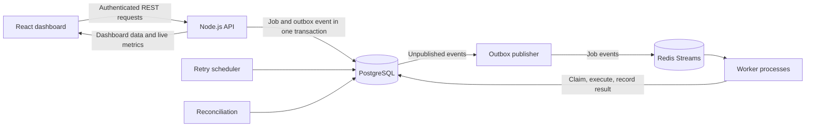
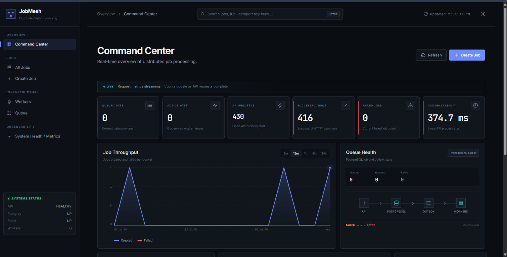
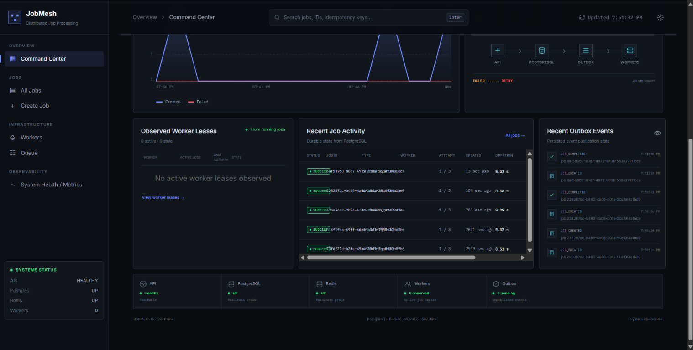
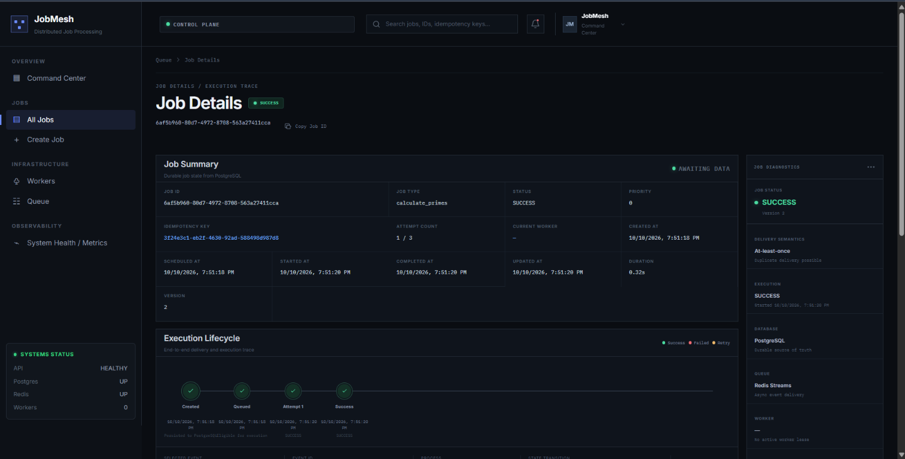
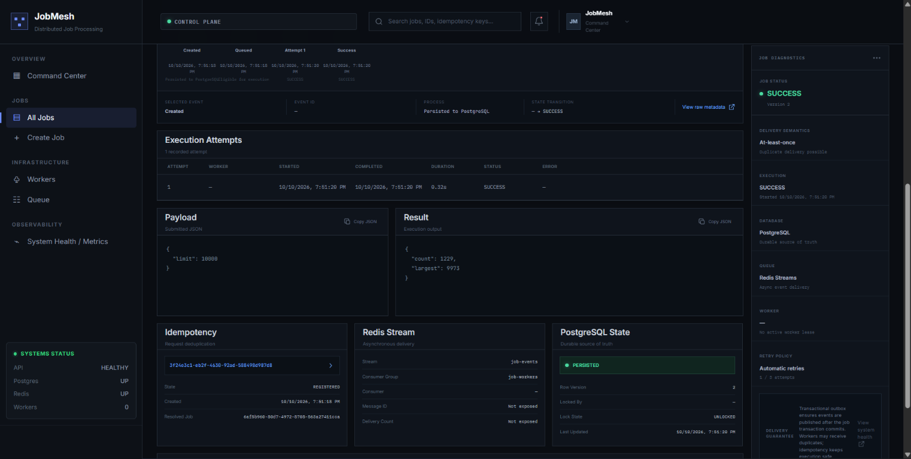

# JobMesh

**JobMesh is a full-stack distributed job-processing platform for submitting,
dispatching, executing, and monitoring asynchronous work.** Its Node.js API
accepts authenticated job requests and persists each job together with a
transactional outbox event in PostgreSQL. An outbox publisher delivers those
events through Redis Streams, where independently running workers compete to
claim and execute eligible jobs. PostgreSQL remains the durable source of
truth; the React dashboard provides a live view of job progress, worker
activity, queue health, and system metrics.

The project brings the control plane and execution plane together: a
browser-based operations console, a session-protected REST API, persistent
queue and attempt history, and background services for delivery, retries, and
recovery.

## How it works



1. A client submits a job with a type, JSON payload, and idempotency key.
2. The API stores the `QUEUED` job and its `JOB_CREATED` outbox event in one
   PostgreSQL transaction, so a committed job cannot be separated from its
   delivery record.
3. The outbox publisher forwards pending events to a Redis Stream. Workers
   consume events and atomically claim due jobs in PostgreSQL before execution.
4. Each attempt is recorded. Successful results are persisted; failures can be
   retried with a delay up to the configured attempt limit.
5. Reconciliation identifies stale running jobs and requeues or fails them
   according to their remaining attempts.
6. The dashboard reads durable job and queue state from PostgreSQL and streams
   request metrics from the API.

## Capabilities

- **Asynchronous job execution:** submit work without tying up the API request
  while it runs.
- **Transactional event delivery:** persist a job and its outbox event together,
  then publish events to Redis Streams for worker consumption.
- **Safe concurrent claims:** workers use conditional PostgreSQL updates so a
  job is claimed by only one worker at a time.
- **Idempotent submissions:** scope idempotency keys to the authenticated user
  to avoid duplicate jobs from repeated requests.
- **Attempt history and retries:** record execution attempts, errors, results,
  and retry scheduling; enforce a configurable maximum attempt count.
- **Stuck-job recovery:** periodically inspect stale running jobs and make
  remaining work eligible for another attempt.
- **Account-scoped API access:** authenticate with password-based accounts and
  revocable, expiring sessions; restrict job data to its owner.
- **Operational visibility:** inspect job details, results, attempts, outbox
  delivery, queue health, worker leases, and API metrics from the dashboard.
- **Built-in workload types:** calculate primes, process JSON, run CPU-intensive
  work, and execute duration-based long-running jobs.

## Screenshots

### Command center



### Activity and outbox health



### Job details



### Execution details



Account details have been removed from the screenshots.

## Components

- **Frontend:** React, TypeScript, and Vite operations dashboard.
- **Backend:** Node.js and Express REST API, job handlers, and worker services.
- **Persistence:** PostgreSQL stores users, sessions, jobs, attempts, and
  transactional outbox events.
- **Delivery:** Redis Streams carries asynchronous events from the outbox to
  worker consumer groups.
- **Runtime configuration:** environment variables configure PostgreSQL,
  Upstash Redis, API limits, session expiry, retry policy, and worker identity.
- **CI:** [`.github/workflows/ci.yml`](.github/workflows/ci.yml) builds the
  frontend and runs backend tests against PostgreSQL.

## Local development

Use Node.js 22 or later, PostgreSQL, and an Upstash Redis REST database. Copy
[`backend/.env.example`](backend/.env.example) to `backend/.env` and configure
the database and Redis credentials.

Start each process in a separate terminal:

```sh
cd backend
npm ci
npm run dev
```

```sh
cd backend
npm run worker
```

```sh
cd frontend
npm ci
npm run dev
```

The backend test suite can be run with:

```sh
npm test --prefix backend
```
